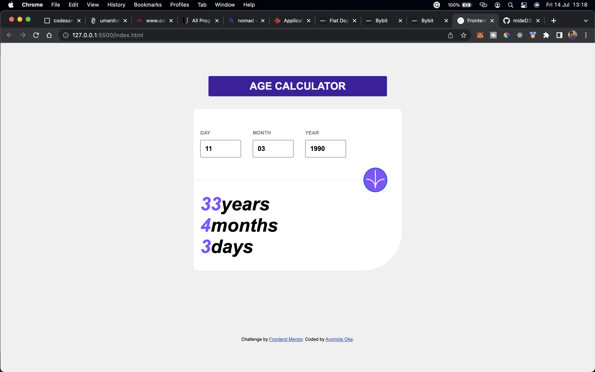
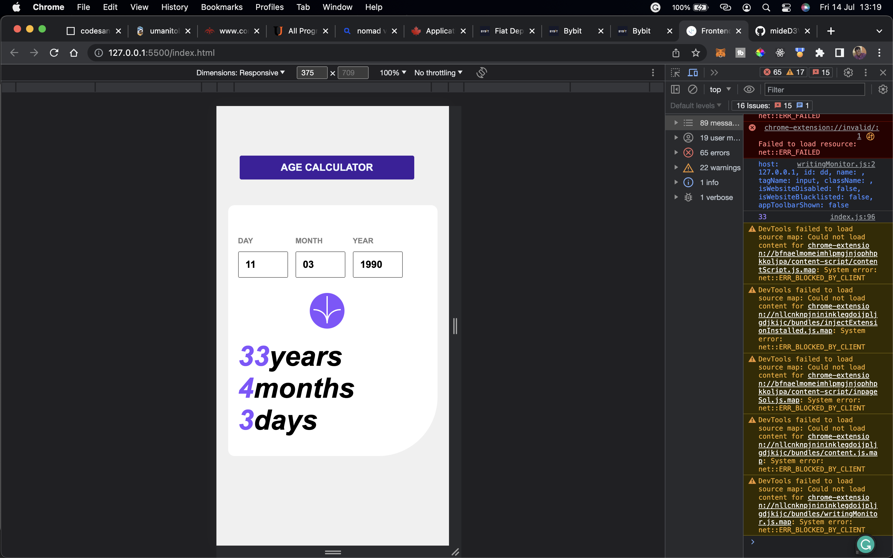

# Frontend Mentor - Age calculator app

## Welcome! 👋

Thanks for checking out this front-end coding challenge.

e With this app, you can use this app to calculate your age in years, months, and days.

You will also get an error message if you enter an invalid date of birth.

### Links
- Live Site URL: https://my-agecalculatorapp.netlify.app/

### Screenshots

### Built with
- HTML
- CSS
- JavaScript
- Flexbox
- Semantic HTML5 markup
- CSS custom properties

### Challenges
After completing the page structure and styles, i had a challenge with the logic to find the age differences.
Then i did a lot of research using YouTube, Google, and Stackoverflow to gain insight and learn the solution which I implemented in my code.
